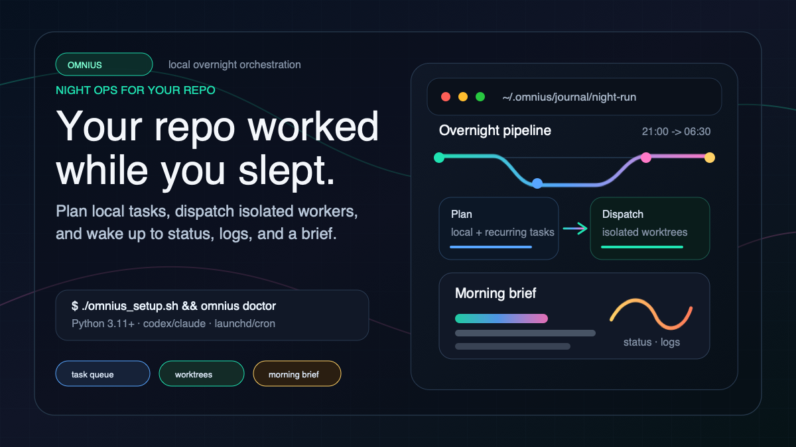

# Omnius



Omnius is a local overnight orchestration tool that plans work from a task queue, dispatches isolated agent sessions against configured git repositories, and writes a morning status brief.

## Requirements

- macOS or Linux
- Python 3.11 or newer
- Git
- A local runner CLI for real worker execution: `codex` or `claude`
- `launchd` on macOS or `cron` on Linux for scheduled runs

## Quick Start

From a fresh clone:

```bash
./omnius_setup.sh
omnius doctor
```

The setup script installs Omnius into the current user's Python site packages, creates the default workspace at `~/.omnius`, writes `~/.omnius/omnius.toml` when it is missing, and installs the scheduler backend for the current OS.

For a non-interactive install:

```bash
./omnius_setup.sh \
  --non-interactive \
  --runner codex \
  --repo-path /path/to/repo \
  --repo-slug repo \
  --repo-branch main
```

The default scheduler backends are:

- macOS: `launchd`
- Linux: `cron`

Set `OMNIUS_HOME=/path/to/workspace` to use a workspace other than `~/.omnius`.

## Configuration

Omnius reads `omnius.toml` from the workspace directory. The default configuration looks like this:

```toml
[global]
timezone = "America/Los_Angeles"
pipeline_cron = "0 21 * * 0-4"
pipeline_budget_minutes = 540
default_task_budget_minutes = 120
max_consecutive_failures = 3
notification_backend = "none"

[runner]
default = "codex"
planner_dayprep_mode = "placeholder"

[capabilities]
brainstorm = "auto"
review_diff = "auto"
autonomous_testing = "auto"
second_opinion = "auto"

[[repos]]
slug = "repo"
path = "/path/to/repo"
branch = "main"
role = "primary"
labels = []
```

`pipeline_cron` is the schedule source of truth. Run `omnius install`, `omnius install-cron`, or `omnius install-launchd` after changing scheduler settings.

Fresh configs use `planner_dayprep_mode = "placeholder"` so scheduled runs do not unexpectedly spend provider credits on planner and morning-brief compilation. Set it to `"real"` when the configured runner should generate those outputs. Worker tasks still use the default runner or the task-level `--agent` override.

## Commands

Install and scheduler lifecycle:

```bash
omnius install
omnius install-cron
omnius install-launchd
omnius doctor
omnius uninstall
```

Run and inspect the pipeline:

```bash
omnius run
omnius status
omnius status --json
omnius status --brief
omnius status --attention
omnius logs
omnius logs cron
omnius logs dispatch
omnius logs worker O00001
omnius logs errors
```

Manage local tasks:

```bash
omnius task add --title "Task title" --repo repo --body "Task markdown body"
omnius task add --title "Task title" --repo repo --body "Task markdown body" --agent claude
omnius task list
omnius task show O00001
omnius task complete O00001
omnius task pending
omnius task recurring
```

Runtime controls:

```bash
omnius stop --dry-run
omnius stop --force
omnius recover
```

## Runtime Model

Each pipeline run bootstraps the workspace, validates config, checks runner availability, runs preflight checks against the configured repo, gathers local and recurring tasks, builds a planner manifest, dispatches workers sequentially in per-task git worktrees, and writes journal artifacts under `~/.omnius/journal`.

Preflight rejects unsafe run conditions such as dirty repos, merge or rebase state, unwritable runtime paths, missing runner commands, and low disk space. Pipeline budgets, task budgets, and consecutive-failure limits are enforced from `omnius.toml`.

Omnius only archives a task after the worker reports a durable result, such as a committed task branch or PR URL.

## Development

Run the test suite with any Python 3.11+ interpreter:

```bash
PYTHONPATH=src python3.13 -m unittest discover -s tests
```

Package metadata lives in `pyproject.toml`, and the console script entrypoint is `omnius = "omnius.cli:main"`.
